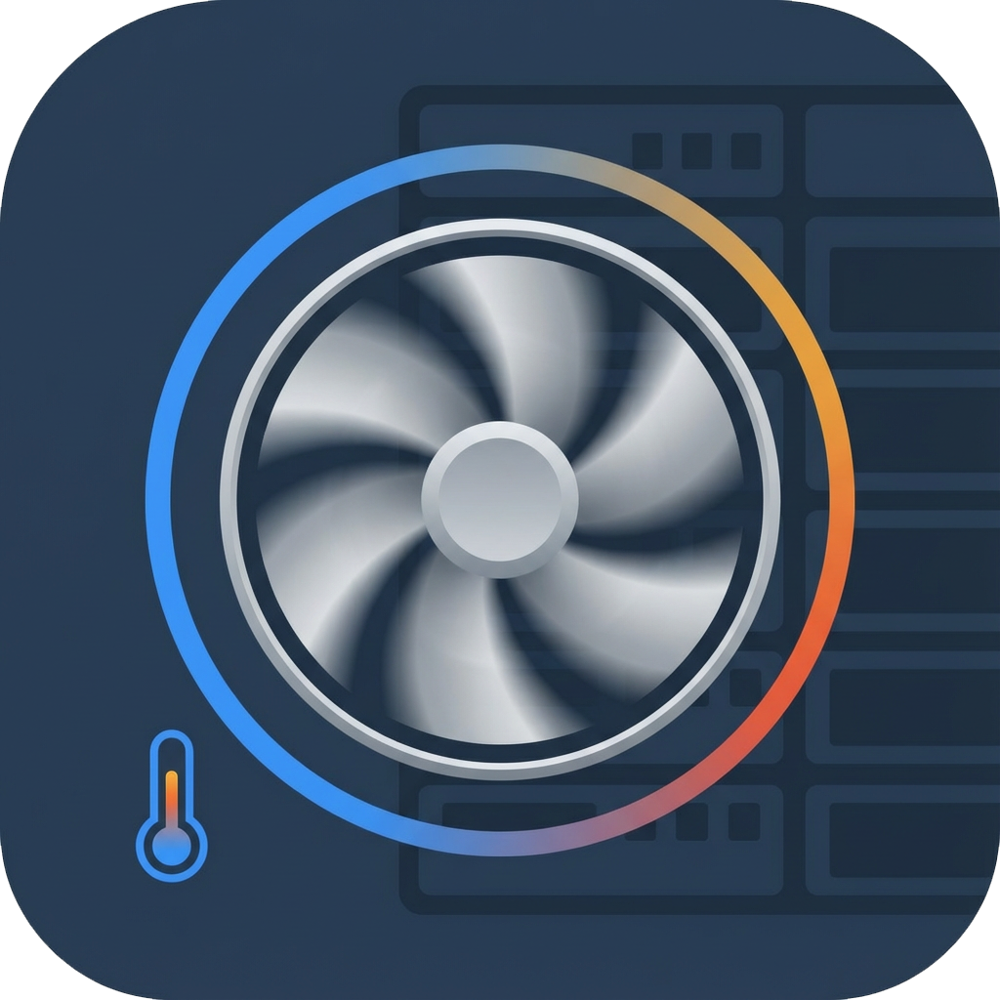
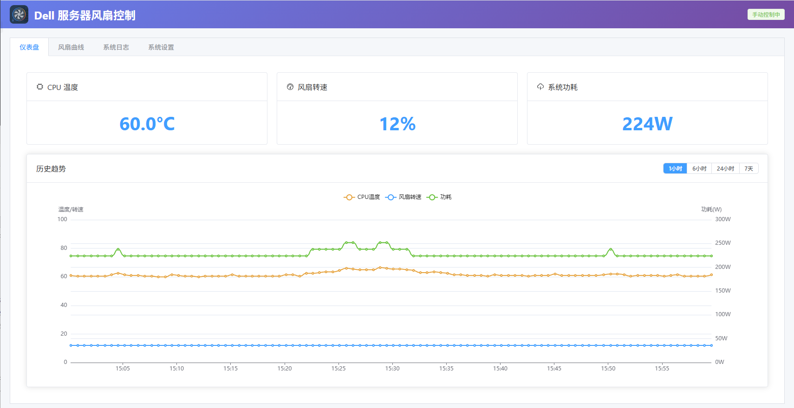

<p align="center">
  
</p>

<h1 align="center">Dell 服务器风扇控制系统</h1>

<p align="center">
一个现代化的 Dell 服务器风扇控制 Web 应用，支持可视化曲线编辑、实时监控和历史数据分析。
</p>

<p align="center">
  
</p>

## 功能特性

- 🌡️ 实时监控 CPU 温度、风扇转速、系统功耗
- 📈 可视化风扇曲线编辑器
- 📊 历史数据趋势图（1小时/6小时/24小时/7天）
- 📝 实时日志查看，支持级别过滤和搜索
- ⚙️ Web 界面配置管理
- 🐳 Docker 一键部署

## 技术栈

- 后端：FastAPI + SQLite + WebSocket
- 前端：Vue 3 + Element Plus + ECharts
- 部署：Docker

## 快速部署

### 前置要求

- Docker & Docker Compose
- Dell iDRAC Tools 安装包

### 1. 下载 Dell iDRAC Tools

从 Dell 官网下载 iDRAC Tools Linux 版本：

**下载链接：** [Dell iDRAC Tools](https://www.dell.com/support/home/en-us/drivers/driversdetails?driverid=j72j9)

下载后将 `Dell-iDRACTools-Web-LX-*.tar.gz` 文件放到项目根目录，并修改 `Dockerfile` 中的文件名：

```dockerfile
ARG DRACTOOLS_PKG=Dell-iDRACTools-Web-LX-11.2.0.0-213_A00.tar.gz  # 改为你下载的实际文件名
```

### 2. 一键启动

```bash
# 克隆项目
git clone <your-repo-url>
cd dell-fan-controller

# 启动服务
./docker-start.sh

# 或手动执行
export DOCKER_BUILDKIT=0
docker-compose build
docker-compose up -d
```

访问地址：http://your-server-ip:5936

## 首次配置

1. 打开浏览器访问 `http://your-server-ip:5936`
2. 进入「系统设置」页面
3. 填写 iDRAC 连接信息：
   - IP 地址：服务器 iDRAC 的 IP
   - 用户名：iDRAC 管理员账号
   - 密码：iDRAC 密码
   - 监控间隔：建议 30 秒
4. 保存设置
5. 进入「风扇曲线」页面，根据需要调整温度-转速曲线

## 项目结构

```
dell-fan-controller/
├── backend/                # 后端代码
│   ├── main.py             # FastAPI 入口
│   ├── database.py         # 数据库模型
│   ├── api/                # API 路由
│   └── services/           # 业务服务
├── frontend/               # 前端代码
│   ├── src/
│   │   ├── components/     # Vue 组件
│   │   └── stores/         # Pinia 状态管理
│   └── package.json
├── data/                   # 数据目录（挂载卷）
├── docker-compose.yml
├── Dockerfile
├── docker-start.sh         # 一键启动脚本
└── start.sh                # 容器启动脚本
```

## 常用命令

```bash
# 查看日志
docker-compose logs -f

# 重启服务
docker-compose restart

# 停止服务
docker-compose down

# 重新构建
./docker-start.sh
```

## API 文档

启动后访问：`http://your-server-ip:5936/docs`

## 注意事项

- **必须下载 Dell iDRAC Tools** 才能正常控制风扇
- 确保服务器 iDRAC 网络可达
- 数据持久化在 `./data` 目录

## 开源协议

本项目基于 [MIT License](LICENSE) 开源。
